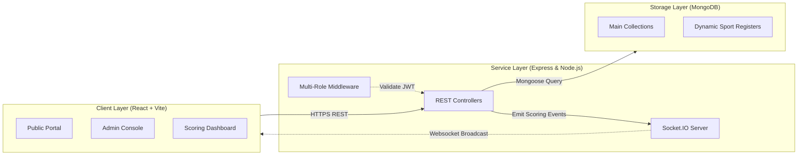

# 🏆 Sankalp Sports Fest Live Scoreboard

[](LICENSE)
[](CONTRIBUTING.md)
[](docs/SocketIO.md)
[](package.json)
[](frontend/tailwind.config.js)

🔗 **Live Demo**: [https://sankalp-scorecard.vercel.app/](https://sankalp-scorecard.vercel.app/)

A real-time, premium sports event management platform built for the official sports fest conducted by **Keshav Memorial College of Engineering** under the student club **SANKALP**. 

Designed to deliver instant ball-by-ball updates, live tournament bracket generation, role-based admin dashboard control, and dynamic player drafting.

---

## ⚡ Key Highlights
*   **Real-Time Scoring Platform**: Low-latency score updates powered by Socket.IO, custom-built for high-demand tournament scenarios.
*   **Dynamic Bracket Generator**: Automatically shuffles teams, handles solo registrations as free agents, and compiles full tournament trees bottom-up (Quarter-Finals, Semi-Finals, Finals).
*   **Granular Multi-Role Access**: Segregated admin privileges:
    *   `Master Admin`: Create sports, configure overall tournament scopes, and assign Sport Admins.
    *   `Sport Admin`: Control team drafting, player pools, matches, and bracket generation for a single sport category.
    *   `Match Scorer`: Scorer view restricted strictly to assigned live cricket scoreboards.
*   **Rich Interactive Aesthetics**: Premium dark-mode interface utilizing **Matter.js** physics engine for interactive background particles and **Framer Motion** for micro-animations.

---

## 🗺️ Project Architecture



For a deeper dive into the system workflow, check the [Architecture Documentation](docs/Architecture.md).

---

## 📂 Repository Structure

The codebase is split into a client-server architecture:

```
sankalp_scorecard/
├── backend/                  # Server codebase (Express, Mongoose, Socket.io)
│   ├── models/               # Data model schemas (Admin, Match, Team, CricketState, etc.)
│   ├── routes/               # API endpoint routing logic
│   └── seeders/              # Initial database seeding scripts
├── frontend/                 # Client codebase (React, Vite, Matter.js, Framer Motion)
│   ├── src/
│   │   ├── components/       # Shared UI fragments (Brackets, Headers, Physics Engine)
│   │   ├── pages/            # App route views (Dashboard, Live Scorecard, Leaderboard)
│   │   └── App.jsx           # Client router entry point
└── docs/                     # Comprehensive engineering documents & playbooks
```

Explore our folder layout details inside the [Folder Documentation Guide](docs/Architecture.md#folder-documentation).

---

## ⚙️ Quick Setup

### Prerequisites
*   [Node.js](https://nodejs.org/) (v18.0.0+)
*   [MongoDB](https://www.mongodb.com/) (Local server or MongoDB Atlas Cloud instance)

---

### 1. Backend Setup
1.  Navigate to the backend directory:
    ```bash
    cd backend
    ```
2.  Install required packages:
    ```bash
    npm install
    ```
3.  Configure your environment parameters. Copy `.env` and adjust the variables if needed:
    ```ini
    PORT=5000
    MONGO_URI=mongodb://127.0.0.1:27017/sankalp_scoreboard
    JWT_SECRET=sankalp_super_secret_key_2026
    CLIENT_URL=http://localhost:5173
    ```
4.  Seed the database with sports, teams, and sample match credentials:
    ```bash
    npm run seed
    ```
    > [!IMPORTANT]
    > **Default Master Credentials:**
    > *   **Username**: `admin`
    > *   **Password**: `password123`
5.  Start the Express server in development mode:
    ```bash
    npm run dev
    ```

---

### 2. Frontend Setup
1.  Open a new terminal window and navigate to the frontend directory:
    ```bash
    cd frontend
    ```
2.  Install dependencies:
    ```bash
    npm install
    ```
3.  Configure your local client settings. Copy `.env` if necessary:
    ```ini
    VITE_API_URL=http://localhost:5000/api
    ```
4.  Launch the Vite developer environment:
    ```bash
    npm run dev
    ```
5.  Open your browser and navigate to `http://localhost:5173`.

---

## 🔐 Environment Variables Reference

### Backend (`backend/.env`)
| Variable | Default Value | Description |
| :--- | :--- | :--- |
| `PORT` | `5000` | Port where the server will listen for requests. |
| `MONGO_URI` | `mongodb://127.0.0.1:27017/sankalp_scoreboard` | Connection string to MongoDB instance. |
| `JWT_SECRET` | `sankalp_super_secret_key_2026` | Token secret used to sign admin credentials. |
| `CLIENT_URL` | `http://localhost:5173` | CORS allowed origin parameter. |

### Frontend (`frontend/.env`)
| Variable | Default Value | Description |
| :--- | :--- | :--- |
| `VITE_API_URL` | `http://localhost:5000/api` | Target backend REST API URL. |

---

## 📖 Component Manuals

To make the codebase accessible to external developers, we provide extensive module logs:

*   📖 **[Architecture & Lifecycles](docs/Architecture.md)**: Network diagrams, client routers, middleware logic.
*   📖 **[Database Schema Directory](docs/Database.md)**: Mongoose relations, dynamic registration structures, indexing policies.
*   📖 **[Socket.IO Events](docs/SocketIO.md)**: WebSocket connection guidelines, event timelines, scoring sync loops.
*   📖 **[Deployment Manual](docs/Deployment.md)**: Guides for Vercel, Render, and MongoDB Atlas.
*   📖 **[Admin Console Operations](docs/Admin.md)**: How to compile teams, generate brackets, and score live cricket matches.
*   📖 **[REST API Reference](docs/API.md)**: Path validators, route paths, payload objects.
*   📖 **[FAQ Ledger](docs/FAQ.md)**: Frequently Asked Questions.

---

## 📈 Open-Source Development Roadmap

- [x] **Phase 1: Basic Scorer Console** (Cricket state tracking, runs off bat, extras validation, undo steps).
- [x] **Phase 2: Dynamic Bracketing** (Tournament layout, automatic winner nodes, bracket resets).
- [ ] **Phase 3: Client Optimization** (Socket namespaces, canvas-rendering performance fallbacks).
- [ ] **Phase 4: Match Analytics** (Export matches as JSON, tournament histories).
- [ ] **Phase 5: Extended Game Templates** (Native scoring layouts for Kabaddi, Kho-Kho, and Football).

---

## 🤝 Contributing

We welcome community contributions! Please read our [Contributing Guidelines](CONTRIBUTING.md) and review our [Code of Conduct](CODE_OF_CONDUCT.md) before submitting pull requests.

---

## 🛡️ Security

If you discover a security vulnerability, please check our [Security Policy](SECURITY.md) for instructions on how to submit details.

---

## 📄 License

Distributed under the **MIT License**. See [LICENSE](LICENSE) for details. Developed with 💛 for the **SANKALP Club**, Keshav Memorial College of Engineering.
