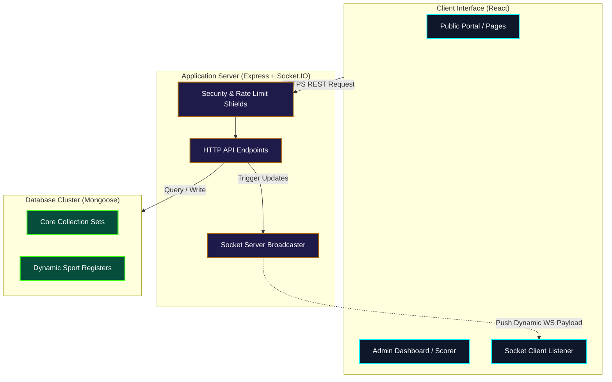
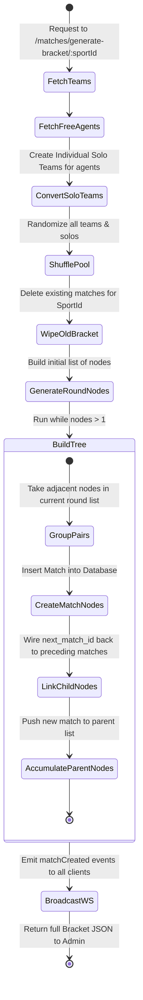

# 🗺️ System Architecture Guide

This guide details the structural architecture, component divisions, request lifecycles, and folder layouts of the **Sankalp Sports Fest Live Scoreboard** codebase.

---

## 1. High-Level Architecture Overview

Sankalp Scorecard is built on a standard **MERN** (MongoDB, Express, React, Node.js) tech stack, combined with a persistent **Socket.IO** real-time transport layer.



---

## 2. Request and Event Lifecycles

Understanding data flows is critical for open-source maintenance. Below are step-by-step lifecycles of key features.

### A. User Registration & Dynamic Collection Routing
When a student signs up for a sport on the public site:
1.  **Frontend Form Dispatch**: React posts a JSON payload to `/api/registrations`.
2.  **Model Selection**: The backend grabs the dynamic collection helper:
    ```javascript
    const SportRegistration = getRegistrationModel(sportName);
    const AdminSport = getAdminSportModel(sportName);
    ```
3.  **Sanitization**: Collection names are sanitized to lowercase letters and numbers (`Badminton Men` -> `badminton-men-registrations`).
4.  **Save & Sync**:
    *   Saves participant details in the dynamic registration collection.
    *   Duplicates references to `${sanitizedSportName}-admin` with `isAssignedToTeam: false` to allow Sport Admins to draft the user.

---

### B. Admin Bracket Generation Flow
The automated tournament bracket compiles bottom-up:


---

### C. Live Scoreboard Synchronization (Socket.IO)
1.  **Scoring Input**: A Scorer updates values on the Cricket Console (e.g., scoring a ball of 4 runs).
2.  **API Mutation**: React makes a secure POST request to `/api/cricket/:matchId/ball`.
3.  **Database Updates**:
    *   Creates a new transaction log inside the `CricketBall` collection.
    *   Accumulates runs, updates balls faced, recalculates overs (floating calculations like `1.4` overs), and saves changes to the `CricketState` document.
4.  **Event Broadcast**:
    *   The backend retrieves the Socket server instance: `req.app.get('io')`.
    *   Emits three concurrent updates:
        *   `cricketBall-${matchId}`: Pushes the new ball object.
        *   `cricketUpdate-${matchId}`: Pushes the updated global innings state.
        *   `cricketStateUpdated`: General status sync event.
5.  **Client Reactivity**: The public frontend listens for the dynamic channel `cricketUpdate-${matchId}`. Upon receiving the payload, it triggers a lightweight visual render without requiring page reloads.

---

## 3. Folder Directory Structure

### 📁 Backend Layer
*   `models/`: Schema structures detailing database representations.
    *   [Admin.js](file:///c:/Users/MohithK/OneDrive/Desktop/sankalp_scorecard/backend/models/Admin.js): Defines administrators, salt hashes, and roles (`Master`, `SportAdmin`, `MatchScorer`).
    *   [CricketBall.js](file:///c:/Users/MohithK/OneDrive/Desktop/sankalp_scorecard/backend/models/CricketBall.js): Transaction records for each delivery, detailing extras, dismissals, and undos.
    *   [CricketState.js](file:///c:/Users/MohithK/OneDrive/Desktop/sankalp_scorecard/backend/models/CricketState.js): Live innings details.
    *   [Match.js](file:///c:/Users/MohithK/OneDrive/Desktop/sankalp_scorecard/backend/models/Match.js): Tournament details including bracket trees (round index, previous and next match connections).
    *   [Player.js](file:///c:/Users/MohithK/OneDrive/Desktop/sankalp_scorecard/backend/models/Player.js): Player details.
    *   [Registration.js](file:///c:/Users/MohithK/OneDrive/Desktop/sankalp_scorecard/backend/models/Registration.js): Holds the dynamic compilation engine for sport-specific collections.
    *   [Sport.js](file:///c:/Users/MohithK/OneDrive/Desktop/sankalp_scorecard/backend/models/Sport.js): Catalog containing sport titles and division rules.
    *   [Team.js](file:///c:/Users/MohithK/OneDrive/Desktop/sankalp_scorecard/backend/models/Team.js): Group definitions.
*   `routes/`: Controllers handling REST APIs.
    *   [api.js](file:///c:/Users/MohithK/OneDrive/Desktop/sankalp_scorecard/backend/routes/api.js): General system administration, registration logs, player drafts, and bracket generation.
    *   [cricket.js](file:///c:/Users/MohithK/OneDrive/Desktop/sankalp_scorecard/backend/routes/cricket.js): Handles scoring calculations, tosses, undos, and scoreboard locks.
*   `seeders/`: Database mock bootstrap tools.
    *   [seed.js](file:///c:/Users/MohithK/OneDrive/Desktop/sankalp_scorecard/backend/seeders/seed.js): Seeds the database, creates dynamic sport admins, and setups sample teams.
*   [server.js](file:///c:/Users/MohithK/OneDrive/Desktop/sankalp_scorecard/backend/server.js): Root server setup. Enforces rate limits, security HTTP headers (Helmet), NoSQL injections guards, and handles WebSocket initialization.

---

### 📁 Frontend Layer
*   `src/components/`:
    *   [PhysicsBackground.jsx](file:///c:/Users/MohithK/OneDrive/Desktop/sankalp_scorecard/frontend/src/components/PhysicsBackground.jsx): Renders an interactive physics canvas powered by `matter-js`.
    *   [TournamentBracket.jsx](file:///c:/Users/MohithK/OneDrive/Desktop/sankalp_scorecard/frontend/src/components/TournamentBracket.jsx): Custom SVG tree builder that visualizes bracket configurations dynamically.
    *   [Header.jsx](file:///c:/Users/MohithK/OneDrive/Desktop/sankalp_scorecard/frontend/src/components/Header.jsx): Navigation header featuring responsive slide-outs and dynamic active routes.
    *   [SEO.jsx](file:///c:/Users/MohithK/OneDrive/Desktop/sankalp_scorecard/frontend/src/components/SEO.jsx): Manages page titles and meta descriptions using `react-helmet-async`.
*   `src/pages/`:
    *   `admin/`:
        *   [AdminLogin.jsx](file:///c:/Users/MohithK/OneDrive/Desktop/sankalp_scorecard/frontend/src/pages/admin/AdminLogin.jsx): Entry console for administrators.
        *   [AdminDashboard.jsx](file:///c:/Users/MohithK/OneDrive/Desktop/sankalp_scorecard/frontend/src/pages/admin/AdminDashboard.jsx): Admin panel for teams, matches, brackets, and free agents.
        *   [CricketScorer.jsx](file:///c:/Users/MohithK/OneDrive/Desktop/sankalp_scorecard/frontend/src/pages/admin/CricketScorer.jsx): Live scorer controls.
    *   [HomePage.jsx](file:///c:/Users/MohithK/OneDrive/Desktop/sankalp_scorecard/frontend/src/pages/HomePage.jsx): The public landing page showcasing active sports, stats, and navigation.
    *   [ScoreboardPage.jsx](file:///c:/Users/MohithK/OneDrive/Desktop/sankalp_scorecard/frontend/src/pages/ScoreboardPage.jsx): Central score hub.
    *   [MatchPage.jsx](file:///c:/Users/MohithK/OneDrive/Desktop/sankalp_scorecard/frontend/src/pages/MatchPage.jsx): Detail view showing ball-by-ball actions for live matches.
    *   [LeaderboardPage.jsx](file:///c:/Users/MohithK/OneDrive/Desktop/sankalp_scorecard/frontend/src/pages/LeaderboardPage.jsx): Current standing, listing champions for completed tournaments.
*   `src/context/`:
    *   [AlertContext.jsx](file:///c:/Users/MohithK/OneDrive/Desktop/sankalp_scorecard/frontend/src/context/AlertContext.jsx): Standard alerts (`success`, `warning`, `error`, `info`) styled with Framer Motion.
*   [App.jsx](file:///c:/Users/MohithK/OneDrive/Desktop/sankalp_scorecard/frontend/src/App.jsx): Defines public and secure routes with lazy-loaded code-splitting fallbacks.

---

## 4. Multi-Role Authorization Grid

To maintain system integrity, request routes verify user roles using custom middleware in `backend/routes/api.js` and `backend/routes/cricket.js`:

| Role | Scope | Access Scope |
| :--- | :--- | :--- |
| **`Master`** | Full System | All APIs: Add sports, create/assign Sport Admins, edit overall brackets. |
| **`SportAdmin`** | Single Sport Category | Restricted to their assigned `sport_id`. Can draft players, compile teams, create matches, and generate brackets for that sport. |
| **`MatchScorer`** | Individual Match | Restricted to assigned match IDs within the `assigned_matches` array. Only allowed to access the Cricket Scoring Console API for those specific matches. |
