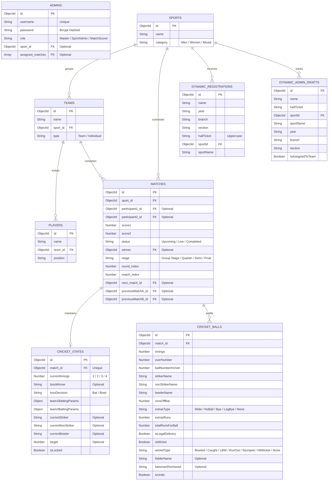

# 🗄️ Database & Schema Directory

This document details the MongoDB data structures, Mongoose schemas, relationships, indexing strategies, and dynamic collection generation used in the **Sankalp Sports Fest Live Scoreboard**.

---

## 1. Entity Relationship (ER) Diagram



---

## 2. Granular Schema Details

All model definitions reside in the `backend/models/` folder.

### A. Admins Collection (`admins`)
Handles admin authentication and segregation of roles.
*   `username` (String, required, unique, trimmed)
*   `password` (String, required): Bcrypt-hashed password.
*   `role` (String, enum: `['Master', 'SportAdmin', 'MatchScorer']`, default: `'SportAdmin'`)
*   `sport_id` (ObjectId -> `Sport`): Used to restrict SportAdmins to a single sport.
*   `assigned_matches` (Array of ObjectIds -> `Match`): Used to restrict MatchScorers to specific matches.

### B. Matches Collection (`matches`)
Forms the nodes of the dynamic tournament bracket.
*   `sport_id` (ObjectId -> `Sport`, required)
*   `participant1_id` (ObjectId -> `Team`, default: `null`)
*   `participant2_id` (ObjectId -> `Team`, default: `null`)
*   `score1` (Number, default: `0`): Runs, goals, points, or games won by Participant 1.
*   `score2` (Number, default: `0`)
*   `status` (String, enum: `['Upcoming', 'Live', 'Completed']`, default: `'Upcoming'`)
*   `winner` (ObjectId -> `Team`, default: `null`)
*   `stage` (String, default: `'Group Stage'`): Text indicating stage progression (e.g. `'Quarter Final'`).
*   `round_index` (Number, default: `0`): Column identifier in bracket visualizations (0 represents the first round).
*   `match_index` (Number, default: `0`): Vertical offset within a bracket column.
*   `next_match_id` (ObjectId -> `Match`, default: `null`): Recipient node for the match winner.
*   `previousMatchA_id` (ObjectId -> `Match`, default: `null`): Input match providing Participant 1.
*   `previousMatchB_id` (ObjectId -> `Match`, default: `null`): Input match providing Participant 2.

### C. Cricket States Collection (`cricketstates`)
Maintains the live state of a cricket match.
*   `match_id` (ObjectId -> `Match`, required, unique)
*   `currentInnings` (Number, default: `1`, enum: `[1, 2, 3, 4]`)
*   `tossWinner` (String, default: `null`)
*   `tossDecision` (String, enum: `['Bat', 'Bowl', null]`, default: `null`)
*   `team1BattingParams` / `team2BattingParams` (Nested Document):
    *   `runs` (Number, default: `0`)
    *   `wickets` (Number, default: `0`)
    *   `overs` (Number, default: `0`): Floating value representation (e.g. `4.3` overs).
    *   `ballsFaced` (Number, default: `0`): Under-the-hood accumulator to perform safe ball divisions.
*   `currentStriker` / `currentNonStriker` / `currentBowler` (String)
*   `target` (Number, default: `null`)
*   `isLocked` (Boolean, default: `false`): Once true, scores are frozen and final winner propagates.

### D. Cricket Balls Collection (`cricketballs`)
Transactional ledger of every delivery. Used to render ball-by-ball commentary timelines.
*   `match_id` (ObjectId -> `Match`, required)
*   `innings` (Number, required)
*   `overNumber` (Number, required): Zero-indexed over identifier.
*   `ballNumberInOver` (Number, required)
*   `strikerName` / `nonStrikerName` / `bowlerName` (String, required)
*   `runsOffBat` (Number, default: `0`)
*   `extrasType` (String, enum: `['Wide', 'NoBall', 'Bye', 'LegBye', 'None']`, default: `'None'`)
*   `extrasRuns` (Number, default: `0`)
*   `totalRunsForBall` (Number, default: `0`): Evaluates to `runsOffBat + extrasRuns`.
*   `isLegalDelivery` (Boolean, default: `true`): Set to false for Wides and No-Balls.
*   `isWicket` (Boolean, default: `false`)
*   `wicketType` (String, enum: `['Bowled', 'Caught', 'LBW', 'RunOut', 'Stumped', 'HitWicket', 'None']`, default: `'None'`)
*   `fielderName` / `batsmanDismissed` (String, default: `null`)
*   `isUndo` (Boolean, default: `false`): Soft-delete flag. If true, calculations bypass this entry.

---

## 3. Dynamic Registration Collection Strategy

To prevent database clutter, the system dynamically spins up dedicated collections for each sport using a compilation factory in `backend/models/Registration.js`.

### Factory Logic
```javascript
export const getRegistrationModel = (sportName) => {
    const sanitizedSportName = sportName.toLowerCase().replace(/[^a-z0-9]/g, '-');
    const collectionName = `${sanitizedSportName}-registrations`;
    const modelName = `Registration_${sanitizedSportName}`;

    if (mongoose.models[modelName]) {
        return mongoose.models[modelName];
    }
    return mongoose.model(modelName, registrationSchema, collectionName);
};
```
*   **Public Collections**: `${sanitizedSportName}-registrations` stores registration data from student forms.
*   **Admin Collections**: `${sanitizedSportName}-admin` tracks players drafting status (`isAssignedToTeam` flag).

---

## 4. Indexing Recommendations

To support scalability during fests with concurrent live users:
1.  **Unique Indexes**:
    *   `admins.username` (Built-in)
    *   `cricketstates.match_id` (Built-in)
2.  **Performance Compound Indexes**:
    *   `cricketballs`: `{ match_id: 1, isUndo: 1, createdAt: -1 }` - Speeds up live score calculation and ball timeline renderings.
    *   `matches`: `{ sport_id: 1, status: 1 }` - Speeds up dynamic scoreboard filters and landing statistics views.
    *   `teams`: `{ name: 1, sport_id: 1 }` (Unique) - Prevents name collisions inside a single tournament.
3.  **Sparse Indexes**:
    *   `matches.next_match_id` (Sparse) - Speeds up bracket propagation updates.
