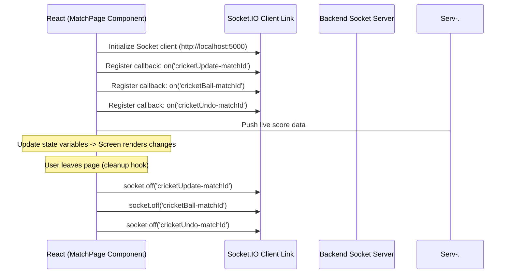

# 🔌 Socket.IO Real-Time Event Guide

This document details the real-time communications architecture, websocket events, connection hooks, and synchronization guidelines of the **Sankalp Sports Fest Live Scoreboard**.

---

## 1. Websocket Server Architecture

The server binds the Socket.IO engine to the standard Express HTTP server inside `backend/server.js`:

```javascript
const io = new Server(server, {
    cors: {
        origin: '*', // Restrict to Client URL in production
        methods: ['GET', 'POST', 'PUT', 'DELETE']
    }
});
```

The socket server instance is bound to the Express app configuration wrapper:
```javascript
app.set('io', io);
```
This allows controllers located inside separate routes files (like `api.js` and `cricket.js`) to trigger broadcasts by resolving `req.app.get('io')`.

---

## 2. Server Event Directory

Below is the directory of events emitted by the backend:

### A. General Matches (Tournament Brackets)
*   **`matchCreated`**
    *   *Payload*: `Match` (Populated object)
    *   *Trigger*: Admin dashboard registers a match or generates a full bracket tree.
    *   *Description*: Notifies clients to append a new match card or update bracket layouts.
*   **`matchUpdated`**
    *   *Payload*: `Match` (Populated object)
    *   *Trigger*: A match score is altered, bracket winners are locked, or a match status updates.
    *   *Description*: Tells clients to re-render the corresponding match node instantly.
*   **`matchDeleted`**
    *   *Payload*: `matchId` (String, ObjectId)
    *   *Trigger*: Admin deletes a match.
    *   *Description*: Tells clients to remove the deleted match node from view.

### B. Cricket Scoring Console (Dynamic Routes)
*   **`cricketStateUpdated`**
    *   *Payload*: `CricketState` (Global state object)
    *   *Trigger*: Scoring configurations, innings starts, and general locks.
    *   *Description*: Alerts all listeners to sync general score tables.
*   **`cricketUpdate-${matchId}`**
    *   *Payload*: `CricketState` (Global state object)
    *   *Trigger*: A delivery event runs, wickets fall, extra runs compile, or tosses configure.
    *   *Description*: Dynamic channel targeting active scoreboard views for a specific match.
*   **`cricketBall-${matchId}`**
    *   *Payload*: `CricketBall` (Ball ledger entry document)
    *   *Trigger*: Scorer logs a delivery.
    *   *Description*: Dynamic channel pushing the new ball to commentary timelines.
*   **`cricketUndo-${matchId}`**
    *   *Payload*: `ballId` (String, ObjectId)
    *   *Trigger*: Scorer clicks "Undo Last Ball".
    *   *Description*: Dynamic channel telling clients to remove the last delivery entry.

---

## 3. Client Implementation Guideline

On the React client, pages subscribe to channels based on active route parameters.

### Subscription Lifecycle
When a user navigates to `/match/:matchId`:


### React Subscription Template
```javascript
import { io } from 'socket.io-client';

useEffect(() => {
    const socket = io(import.meta.env.VITE_SOCKET_URL || 'http://localhost:5000');

    socket.on(`cricketUpdate-${matchId}`, (updatedState) => {
        setMatchState(updatedState);
    });

    socket.on(`cricketBall-${matchId}`, (newBall) => {
        setBallCommentary((prev) => [newBall, ...prev]);
    });

    socket.on(`cricketUndo-${matchId}`, (undoneBallId) => {
        setBallCommentary((prev) => prev.filter(b => b._id !== undoneBallId));
    });

    return () => {
        socket.off(`cricketUpdate-${matchId}`);
        socket.off(`cricketBall-${matchId}`);
        socket.off(`cricketUndo-${matchId}`);
        socket.disconnect();
    };
}, [matchId]);
```

---

## 4. Scalability Improvements (Roadmap)

Currently, the server broadcasts updates to all connected websocket clients. As the sports fest scales, this can create network overhead.

### Recommended Optimizations
1.  **Introduce Room Namespaces**:
    Refactor client connections to join specific match rooms. Instead of dynamic server-wide broadcasts, restrict alerts to joined rooms:
    ```javascript
    // Client Side
    socket.emit('joinMatchRoom', matchId);

    // Server Side
    socket.on('joinMatchRoom', (matchId) => {
        socket.join(matchId);
    });

    // Server Broadcast to Room Only
    io.to(matchId).emit('cricketUpdate', state);
    ```
2.  **Websocket Authentication**:
    Encrypt socket handshakes for administrative scoring connections using token parameter verification during the initial connection.
